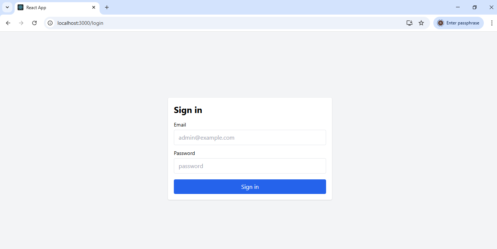
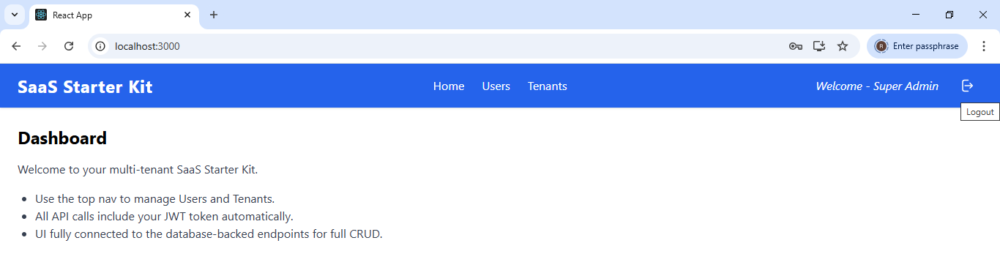
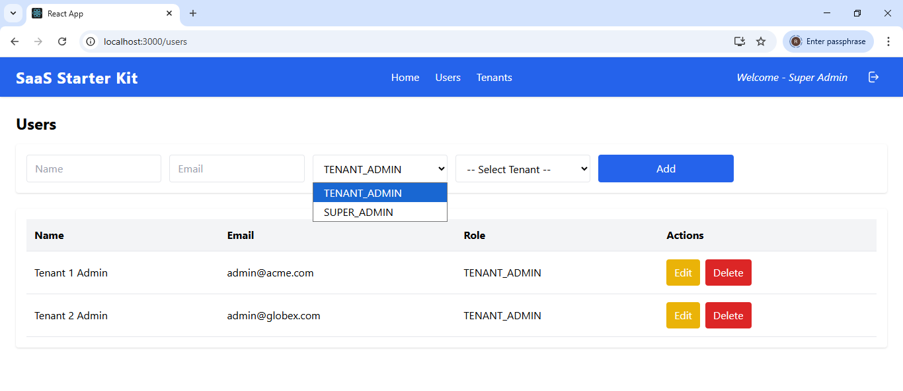
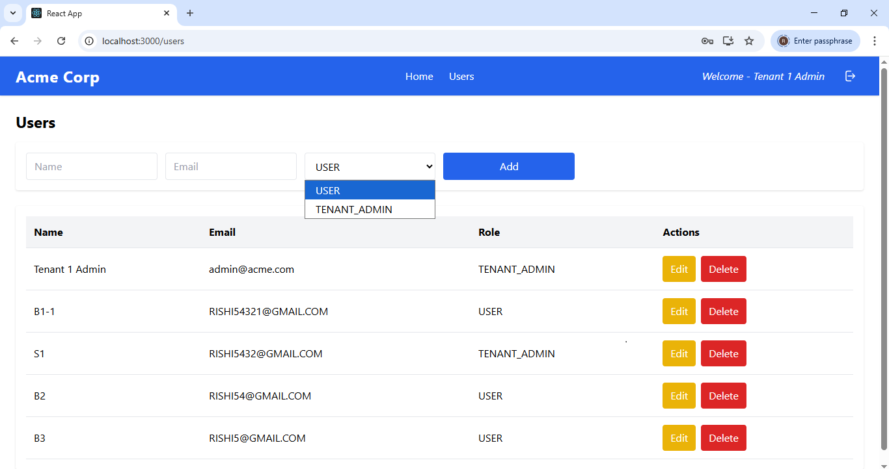
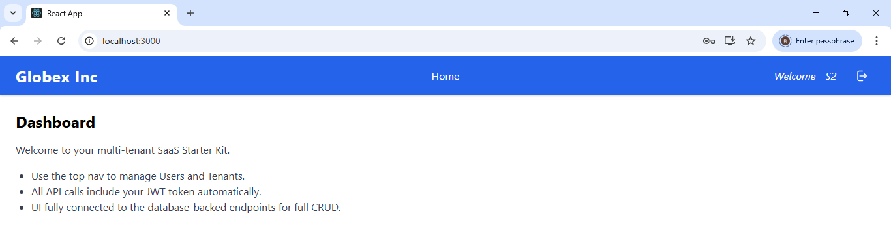

SaaS Starter Kit 🚀

A boilerplate multi-tenant SaaS starter kit with authentication, role-based access control, tenant management, and a React frontend. Designed to help you bootstrap SaaS products quickly with a NestJS backend and React + Tailwind frontend.

## What is SaaS?

**SaaS (Software as a Service)** is a software delivery model where applications are hosted centrally and provided to customers over the internet. Instead of every customer (or organization) installing and maintaining their own copy of the software, a single application instance serves multiple customers.

Each customer is called a **Tenant**. Tenants share the same application codebase but have their own logically separated data. This ensures that while resources are shared, privacy and data integrity are maintained for each tenant.

In this project, tenant separation is achieved by including a `tenantId` (or tenant key) in all relevant database tables. Every record is tied to a specific tenant, and user roles ensure proper access control:
- **Super Admins** manage all tenants.
- **Tenant Admins** manage users within their own tenant.
- **Users** only access their tenant’s data without management privileges.

✨ Features

🔑 Authentication with JWT (login/logout)

👤 User roles: SUPER_ADMIN, TENANT_ADMIN, USER

🏢 Tenant management with tenant-specific admins

🛡 Role-based authorization guards (RolesGuard)

📦 Seed data creator for initial setup (users, tenants)

🧑‍💻 Current user utility module for accessing logged-in user details in frontend

🎨 Frontend in React (Vite) + TailwindCSS

⚡ Backend in NestJS with TypeORM & MySQL

🔐 SaaS Role & Permission Model

SUPER_ADMIN

Can create tenants

Can create Tenant Admins inside tenants

❌ Cannot directly create plain tenant users

TENANT_ADMIN

Can create plain users within their tenant

Can create other tenant admins within their tenant

❌ Cannot create tenants

❌ Cannot create or manage Super Admins

USER (plain tenant user)

❌ Cannot create tenants

❌ Cannot create or manage users

Has access only to application functionality assigned

This enforces a clear separation of privileges for SaaS scalability and security.

🛠 Tech Stack
Backend

NestJS
 (framework)

TypeORM
 (ORM)

MySQL
 (database)

bcrypt
 (password hashing)

JWT
 (authentication)

Frontend

React
 (UI)

Tailwind CSS
 (styling)

jwt-decode
 (decode token in client)

Fetch-based API client with request wrapper

🚀 Getting Started
1. Clone the repo
git clone https://github.com/your-username/your-repo.git
cd your-repo

2. Setup Backend
cd backend
npm install

Create a .env file inside backend/ with:

DATABASE_HOST=localhost
DATABASE_PORT=3306
DATABASE_USER=root
DATABASE_PASS=yourpassword
DATABASE_NAME=saas_db
DEFAULT_USER_PASSWORD=password

Run migrations / seed:

npm run typeorm migration:run
npm run seed

👉 All users created during seeding (including Super Admin & Tenant Admins) will have default password: password
seed data examples: 
super admin uid: superadmin@example.com   pwd: password
tenant admin uid: admin@acme.com          pwd: password
create plain tenent users when application runs.

Start backend:

npx ts-node-dev --respawn src/main.ts

3. Setup Frontend
cd frontend
npm install
npm start

Frontend will run at: http://localhost:3000
Backend runs at: http://localhost:3001

📖 Usage

Login as SUPER_ADMIN (from seed data: seed.ts)

Create tenants

Assign TENANT_ADMIN to tenants (auto-associates tenant ID)

Tenant Admins can create tenant users and other tenant admins

Plain users cannot create/manage any users

Logged-in user details are accessible via src/utils/auth.js

📂 Project Structure
/backend
  /src
    /modules
        /auth
        /users
        /tenants
    /types
  .env
/frontend
  /src
    /api
    /components
    /pages
    /utils (auth.js → get current user)

🤝 Contributing

Fork the repo

Create your feature branch (git checkout -b feature/foo)

Commit changes (git commit -m 'Add foo')

Push branch (git push origin feature/foo)

Create PR

📝 Notes

Default password for all seeded users is password.

Only Super Admins can create tenants.

Use getCurrentUser() from utils/auth.js in frontend for quick access to logged-in user.

## Screenshots

### Login Page

### Dashboard 
Noate: Super admin dashboard clearly shows Home, User and Tenant links in top banner.

### Tenants Management 
Note: Only super admin can see tenant menu.

### User Management- super admin 
Note: Look at the user type selection and select tenant dropdown. Super admins can create other super admins or tenant admins by selecting the tenant from the given dropdown. They can not create tenant users, which are created by their repective tenant admins.

### User Management- tenant admin 
Note: Look at the user type selection (only tenant admin and users can be created) and select tenant dropdown is missing. The top banner does not show tenant link and name of the tenant displays in top banner.

### Tenant User logged in 
Note: The top banner does not show tenant and user link and name of the tenant displays in top banner.

