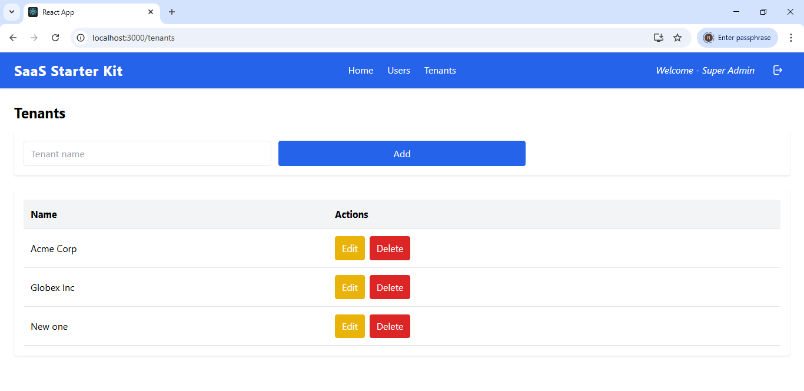

## SaaS Starter Kit 🚀

A boilerplate multi-tenant SaaS starter kit with authentication, role-based access control, tenant management, and a React frontend. Designed to help you bootstrap SaaS products quickly with a NestJS backend and React + Tailwind frontend.

## What is SaaS?

**SaaS (Software as a Service)** is a software delivery model where applications are hosted centrally and provided to customers over the internet. Instead of every customer (or organization) installing and maintaining their own copy of the software, a single application instance serves multiple customers.

Each customer is called a **Tenant**. Tenants share the same application codebase but have their own logically separated data. This ensures that while resources are shared, privacy and data integrity are maintained for each tenant.

In this project, tenant separation is achieved by including a `tenantId` (or tenant key) in all relevant database tables. Every record is tied to a specific tenant, and user roles ensure proper access control:
- **Super Admins** manage all tenants.
- **Tenant Admins** manage users within their own tenant.
- **Users** only access their tenant’s data without management privileges.


✨ Features

  * 🔑 Authentication with **JWT** (login/logout)
  * 👤 User roles: **SUPER\_ADMIN**, **TENANT\_ADMIN**, **USER**
  * 🏢 Tenant management with tenant-specific admins
  * 🛡 Role-based authorization guards (`RolesGuard`)
  * 📦 Seed data creator for initial setup (users, tenants)
  * 🧑‍💻 Current user utility module for accessing logged-in user details in frontend
  * 🎨 Frontend in **React** (Vite) + **TailwindCSS**
  * ⚡ Backend in **NestJS** with **TypeORM** & **MySQL**

-----

## 🔐 SaaS Role & Permission Model

### SUPER\_ADMIN

  * Can create tenants
  * Can create Tenant Admins inside tenants
  * ❌ Cannot directly create plain tenant users

### TENANT\_ADMIN

  * Can create plain users within their tenant
  * Can create other tenant admins within their tenant
  * ❌ Cannot create tenants
  * ❌ Cannot create or manage Super Admins

### USER (plain tenant user)

  * ❌ Cannot create tenants
  * ❌ Cannot create or manage users
  * Has access only to application functionality assigned

This enforces a clear separation of privileges for SaaS scalability and security.

-----

## 🛠 Tech Stack

### Backend

  * **NestJS** (framework)
  * **TypeORM** (ORM)
  * **MySQL** (database)
  * **bcrypt** (password hashing)
  * **JWT** (authentication)

### Frontend

  * **React** (UI)
  * **Tailwind CSS** (styling)
  * **jwt-decode** (decode token in client)
  * Fetch-based API client with request wrapper

-----
## 🧪 Testing

This project includes sample test coverage for both the **frontend** and **backend**:

### Frontend
- **API Unit Tests**  
  Located in the frontend codebase to validate API integration logic.  
  These tests ensure correct request/response handling and proper error handling when interacting with the backend services.

### Backend
- **Service Layer Tests**  
  Unit tests covering the core business logic in the service layer (e.g., authentication, user creation, tenant logic).  
  They ensure that services behave correctly in isolation.

- **End-to-End (E2E) Tests**  
  A sample e2e test suite is provided, validating the complete request/response cycle across the backend, including controllers, services, and database integration.  
  
### Running Tests
```bash
# Frontend
cd frontend
npm test /npx jest

# Backend
cd backend
npm run test         # unit tests
npm run test:e2e    # end-to-end tests

-----

## 🚀 Getting Started

1.  **Clone the repo**

    ```bash
    git clone https://github.com/your-username/your-repo.git
    cd your-repo
    ```

2.  **Setup Backend**

    ```bash
    cd backend
    npm install
    ```

    Create a `.env` file inside `backend/` with:

    ```
    DATABASE_HOST=localhost
    DATABASE_PORT=3306
    DATABASE_USER=root
    DATABASE_PASS=yourpassword
    DATABASE_NAME=saas_db
    DEFAULT_USER_PASSWORD=password
    ```

    Run migrations / seed:

    ```bash
    npm run typeorm migration:run
    npm run seed
    ```

    > 👉 **All users created during seeding** (including Super Admin & Tenant Admins) will have default password: `password`
    > seed data examples:
    > super admin uid: `superadmin@example.com` pwd: `password`
    > tenant admin uid: `admin@acme.com` pwd: `password`
    > create plain tenent users when application runs.

    Start backend:

    ```bash
    npx ts-node-dev --respawn src/main.ts
    ```

3.  **Setup Frontend**

    ```bash
    cd frontend
    npm install
    npm start
    ```

    Frontend will run at: `http://localhost:3000`
    Backend runs at: `http://localhost:3001`

-----

## 📖 Usage

  * **Login as SUPER\_ADMIN** (from seed data: `seed.ts`)
  * **Create tenants**
  * **Assign TENANT\_ADMIN** to tenants (auto-associates tenant ID)
  * **Tenant Admins** can create tenant users and other tenant admins
  * **Plain users** cannot create/manage any users
  * Logged-in user details are accessible via `src/utils/auth.js`

-----

## 📂 Project Structure

```
/backend
  /src
    /modules
      /auth
      /users
      /tenants
    /types
  .env
/frontend
  /src
    /api
    /components
    /pages
    /utils (auth.js → get current user)
```

-----

## 🤝 Contributing

  * Fork the repo
  * Create your feature branch (`git checkout -b feature/foo`)
  * Commit changes (`git commit -m 'Add foo'`)
  * Push branch (`git push origin feature/foo`)
  * Create PR

-----

## 📝 Notes

  * Default password for all seeded users is `password`.
  * Only Super Admins can create tenants.
  * Use `getCurrentUser()` from `utils/auth.js` in frontend for quick access to logged-in user.

## Screenshots

### Login Page


### Dashboard 
Noate: Super admin dashboard clearly shows Home, User and Tenant links in top banner.


### Tenants Management 
Note: Only super admin can see tenant menu.



### User Management- super admin 
Note: Look at the user type selection and select tenant dropdown. Super admins can create other super admins or tenant admins by selecting the tenant from the given dropdown. They can not create tenant users, which are created by their repective tenant admins.


### User Management- tenant admin 
Note: Look at the user type selection (only tenant admin and users can be created) and select tenant dropdown is missing. The top banner does not show tenant link and name of the tenant displays in top banner.


### Tenant User logged in 
Note: The top banner does not show tenant and user link and name of the tenant displays in top banner.


